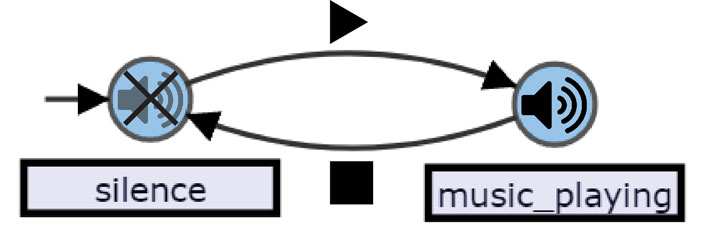
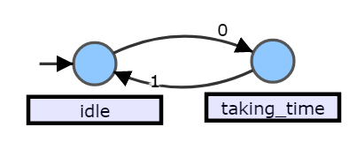

============
Workflow
============

if not using ready-made recipe

Add time-tagger hardware
--------------------------

Click the “Acquisition Device” button on the main screen to open a dialogue.
Specify a relatable name, the number of physically available channels and 
the number of marker channels (specific to PicoQuant HydraHarp400). 

Add analysis instrument via “Instrument Designer”
--------------------------------------------------

Click the “Instrument Designer” button on the main screen to create a new analysis routine and open it in the Instrument Designer. 

This is the place where you define how exactly the ETAbackend analyses your data.

You create an analysis instrument in two steps:

* Create a state diagram (https://en.wikipedia.org/wiki/State_diagram) through which the program transitions that covers all 
  relevant states that your analysis undergoes (left-hand side of the instrument)

* Create some (simple) code to define what actions should be performed upon one (or several) specific transitions (right-hand 
  side of the Instrument Designer)

To get a better understanding, let’s first consider a simple example of a state diagram with two state before we move on to a 
working ETA example.

The states we want to consider for our abstract example are “music_playing” and “silence”. A transition between the states is 
triggered by either “play” or “stop”, depending on the current state.

We start in the “silent” state, indicated by the arrow with it’s tail attached 
nowhere.

If we want this to become musical chairs we need to define some actions. We 
would like participants to start running around the chairs when entering the 
“music_playing” state and sit down on the chairs when entering the “silent” 
state, then remove the participant who did not find a chair and remove one of 
the chairs.

*  We can create a similar diagram to the example above by left-clicking to create a state, left-clicking again to create a second state and left-click-dragging between the states to create the transitions. Or you can left-click-drag on the first state to directly create the second state and a connecting transition and then create the remaining transition by left-click-dragging back from the second state to the first one. It is important for the system to have a defined starting point. We can define the initial state by selecting a state (left-click) and then pressing SHIFT + I (think: Initial). To label a transition with its condition, select a transition and double click it. Transition labels must be channel numbers separated by commas (0,1,2) with channel numbering starting at zero (0).
   
   The labelling mode for states can be entered the same way but names can be any string of allowed characters (alphanumeric and most special characters, but not spaces and commas).
   
   All states and transitions must be labelled.

*  We can use the state diagram described above to analyze a time tag file with two channels in a start-stop manner. For this we need to add a histogram into which we save the time differences between events. We also need a clock to record these time differences. Both these entities can be created with the help of the “Create” menu in the top bar of the Instrument Designer. You can also directly type into the code panel: 
  
  ``HISTOGRAM(name, (number_of_bins, bin_size))``
  
  ``CLOCK(name)``

From this point on I will assume that the state diagram is labelled as follows:

We will define actions so that we use channel 0 as the start channel and channel 1 as the stop channel. (Note, that this analysis will not record time differences between closest events, since the start is not reset if a second event occurs on channel 0 before an event occurs on channel 1. See Section “Coincidence Measurements”)

I will also assume the histogram is named h1 and the clock is named c1.

To define an action you select a transition after which you would like the action to happen.

With this transition selected press SHIFT + T (think: Trigger). You will see state_at_arrow_tail--list_of_channel_numbers-->state_at_arrow_head followed by a colon (:) appear in the code on the right-hand side. By using indentations you can now specify actions that should be performed upon completion of the transition. In case of a start-stop measurement we want to start the clock when there is an event on channel 0. We therefore write:

.. code::

  idle--0-->taking_time:
    c1.start()

To stop the clock and record the time difference in our histogram we write:

.. code::

  taking_time--1-->idle:
    c1.stop()
    h1.record(c1)

Additional Info:
 - States can loop to themselves.
 - Labels can be written underneath the state (e.g. when they become too long to fit) with SHIFT + M (think: Mark)

TODO:explain the following and add more functions

.. code::

  COINCIDENCE()
  TABLE()

Allowed action definitions
TODO: Insert graph

.. code::

    a--1-->b:
      action1
    a--2,4-->b
      action2
    b: #involves all transitions arriving to b
      action3

Add a "Display Panel"
-----------------------
In the ´´Display Panel´´ you tell ETA to run your analysis and define what happens with the result.

A minimum example that saves the data as an Origin-compatitable ´´*.txt´´ file looks as follows:

.. code:: python

    import numpy as np
    result =eta.run(filename, 4) #tell ETA to run the analysis on "filename" in 4 chunks (automatic multi-threading)
    histogram = result["h1"] #get the table from result
    np.savetxt("h1.txt",histogram) #save the txt file for the histogram
    eta.send("processing succeed.") #display message on GUI popup

Instead or in addition to saving a file, the data can be displayed/treated in various ways.
In the following example dash from plotly is used to create an interactive graph from a histogram. 
``app`` is a Dash object which gets modified with the style configurations. 
``eta.display(app)`` is used for displaying the Dash on the GUI side.

.. code:: python

    import numpy as np
    import dash
    import dash_core_components as dcc
    import dash_html_components as html
    import plotly.graph_objs as go
    result =eta.run(filename, 4)
    histogram = result["h1"] #get the table from result

    app = dash.Dash()
    app.layout = html.Div(children=[
        html.H1(children='Result from ETA'),
        html.P(children='+inf_bin={}'.format(inf)),
        dcc.Graph(
            id='example-graph',
            figure={
                'data': [
                    {'x': np.arange(histogram.size), 'y': histogram, 'type': 'bar', 'name': 'SF'},
                ],
                'layout': {
                    'title': expname
                }
            }
        )
    ])

    eta.display(app)

Please refer to our pre-made recipes for inspiration.

Run your analysis
----------------------
Once you have added ´´Hardware´´, ´´Instrument Designer´´ and ´´Display Panel´´, return to the home screen and press ´´Run´´ on the ´´Display Panel´´ of your choice.
